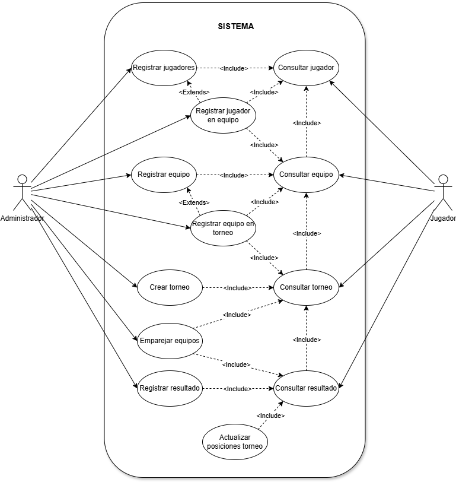
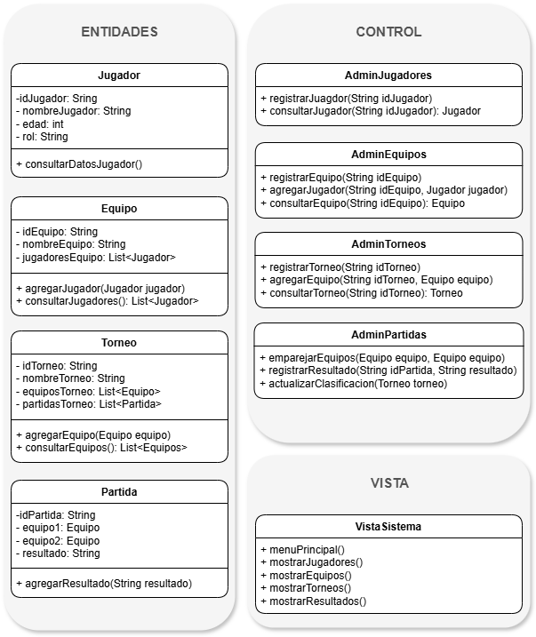
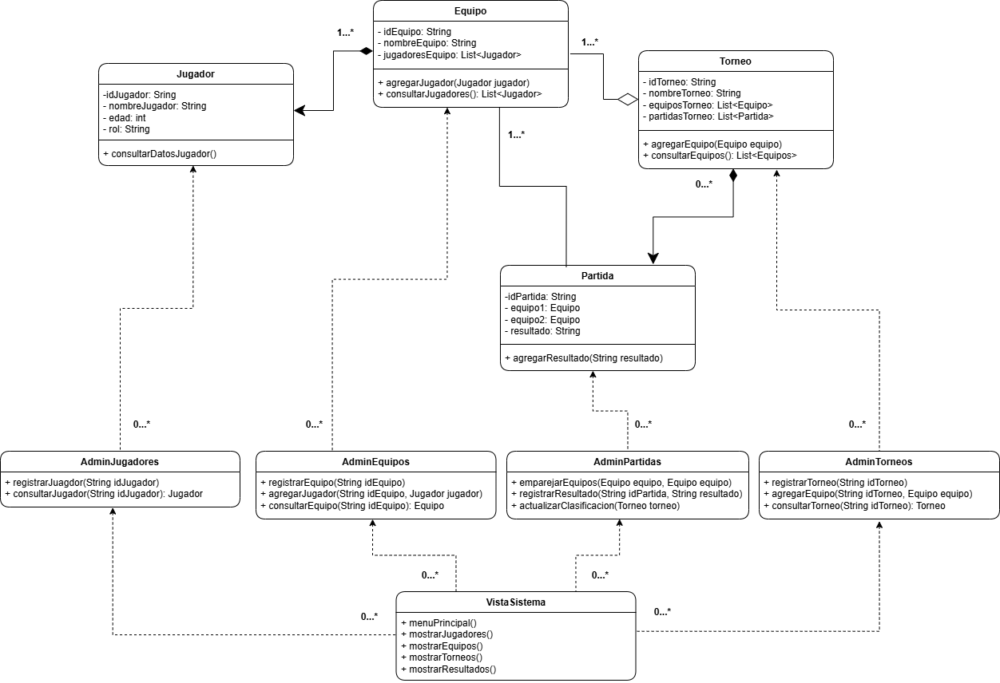

# torneo-esports-uml
Repositorio Actividad 3 Entornos de Desarollo

# Sistema de Gestión de Torneos de eSports

## Autor
Adolfo Martínez Fernández  
AdolMF

## Descripción del Proyecto
[Link al repositorio del proyecto](https://github.com/AdolMF/torneo-esports-uml/)  
Este proyecto implementa un sistema de gestión de torneos de eSports utilizando UML para el modelado y Java para la implementación.

## Diagramas UML
### Diagrama de Casos de Uso
  
Con el diagrama tratamos de reflejar la interaccion de los actores administrador y jugador con el sistema.
El administrador dispondrá de mayor control de manipulación mientras que el jugador podrá conocer la información a diferentes niveles de agregación.  
  
Cada vez que se introduce información nueva en el sistema se revisa que exista o no cualquier información identica previa para evitar duplicados, por ejemplo, si se quiere añadir a un jugador, primero se revisa que no exista. Además, si queremos añadir a un jugador a un equipo, también sería interesante poder crearlo en un sólo proceso, no tener que crearlo y luego añadirlo, por eso Registrar jugador en equipo extiende de Registrar jugadores.Estas mismas casuisticas se aplican a equipos y torneos siempre que aplique.  
  
A la hora de emparejar equipos, se comprueba la informacion del torneo para estar seguros de que un partido se puede dar o no. Tambien se comprueban resultados previos, para estar seguro de que no se haya disputado ya el partido. Una vez existe un resultado en el sistema, se actualizan las posiciones del torneo.
_______________________________________________________________________________  

### Diagrama de Clases
  
Las clases de entidad se relacionan de la siguiente manera:  
- Un **equipo** se compone necesariamente de al menos un jugador y un jugador por definicion, debe estar en un único equipo.
- Un **torneo** agrega equipos, sin embargo, un equipo puede existir independientemente de los torneos.
- Una **partida** es lo que compone a los torneos y la esencia de los mismos, recurre a dos equipos para obtener un resultado.
  
Las clases de control se relacionan de la siguiente manera:  
- **Admin______** gestiona la información relativa a cada una de las clases de entidad con las que mantiene una relacion de dependencia.
  
Por ultimo, la clase de vista tiene una relacion de dependencia con cada una de las clases de control con la idea de unicamente mostrar informacion de cada entidad.
  
_______________________________________________________________________________  

## Estructura del Proyecto 
torneo-esports-uml/  
├── src/  
│ ├── es/empresa/torneo/  
│ │ ├── modelo/  
│ │ ├── control/  
│ │ ├── vista/  
│ │ ├── Main.java  
├── diagrams/  
│ ├── casos-uso.png  
│ ├── clases.png  
├── README.md  
├── .gitignore  

## Instalación y Ejecución
1. Clonar el repositorio:
`git clone https://github.com/AdolMF/torneo-esports-uml.git`

2. Compilar y ejecutar el proyecto:
`cd src javac es/empresa/torneo/Main.java java es.empresa.torneo.Main`

## Justificación del diseño 
La estructura elegida trata de establecer jerarquias entre jugadores, equipos y torneos de manera que de forma sencilla, sea facil administrar cada una de estas clases. Para evitar confusiones se trata de evitar partidos amistosos, es decir, el sistema busca registrar partidos sólo si son parte de un torneo.

Los jugadores podran acceder a la informacion y estadisticas de cualquiera de estos elementos mientras que el administrador será quien tenga un mayor control del sistema.

## Conclusiones Sobre el aprendizaje obtenido.
Los diagramas UML deben entenderse como una documentación útil para tener una visión global de un proyecto de POO de manera que por una parte ayude a organizar el roadmap del proyecto así como distribuir el trabajo de forma estratégica entre diferentes miembros de un equipo.
